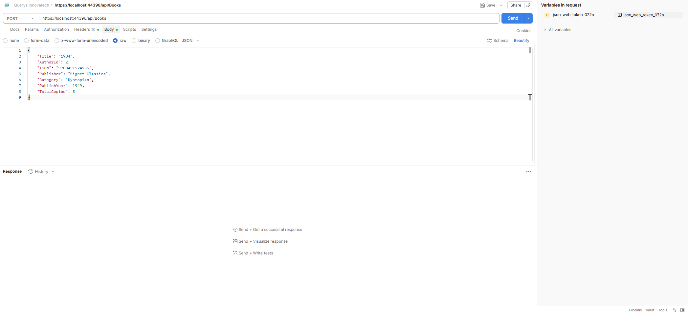
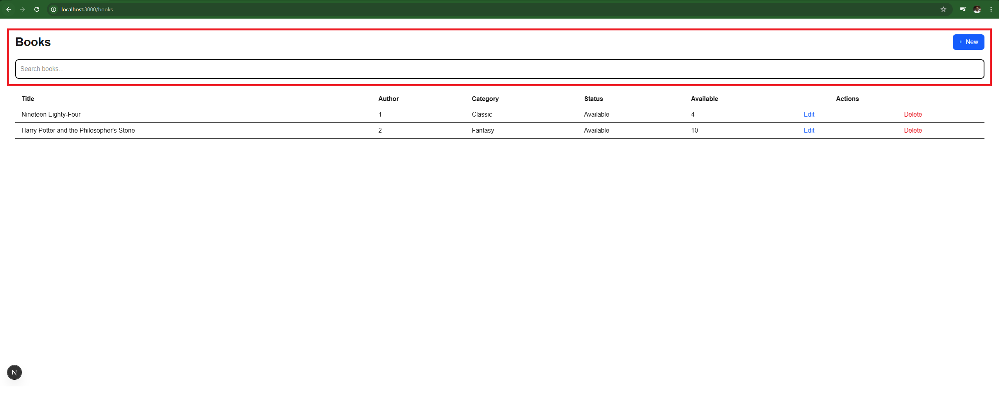

This is a [Next.js](https://nextjs.org) project bootstrapped with [`create-next-app`](https://nextjs.org/docs/app/api-reference/cli/create-next-app).

## Getting Started

First, run the development server:

```bash
npm run dev
# or
yarn dev
# or
pnpm dev
# or
bun dev
```

Open [http://localhost:3000](http://localhost:3000) with your browser to see the result.

You can start editing the page by modifying `app/page.tsx`. The page auto-updates as you edit the file.

This project uses [`next/font`](https://nextjs.org/docs/app/building-your-application/optimizing/fonts) to automatically optimize and load [Geist](https://vercel.com/font), a new font family for Vercel.

## Learn More

To learn more about Next.js, take a look at the following resources:

- [Next.js Documentation](https://nextjs.org/docs) - learn about Next.js features and API.
- [Learn Next.js](https://nextjs.org/learn) - an interactive Next.js tutorial.

You can check out [the Next.js GitHub repository](https://github.com/vercel/next.js) - your feedback and contributions are welcome!

## Deploy on Vercel

The easiest way to deploy your Next.js app is to use the [Vercel Platform](https://vercel.com/new?utm_medium=default-template&filter=next.js&utm_source=create-next-app&utm_campaign=create-next-app-readme) from the creators of Next.js.

Check out our [Next.js deployment documentation](https://nextjs.org/docs/app/building-your-application/deploying) for more details.


## 📋 General Description

This project is a Frontend Web Application developed using:

React.js
Next.js
TypeScript
Axios
REST APIs
JWT Authentication
SSO Authentication
Clean Architecture

The application provides an intuitive user interface while consuming backend REST services in a secure and scalable manner.


## 📋Technology Stack

| Technology                              | Version | Purpose            |
|-----------------------------------------|---------|--------------------|
| React.js                                | 19      | UI Library         |
| Next.js                                 | 16      | React Framework    |
| TypeScript                              | Latest  | Type Safety        |
| Axios                                   | Latest  | HTTP Client        |
| React Hook Form                         | Latest  | Forms              |
| Zod / Yup                               | Latest  | Validation         |
| Tailwind CSS / Material UI              | Latest  | UI Components      |
| Redux Toolkit / Zustand / Context API   | Latest  | State Management   |
| React Query / TanStack Query            | Latest  | Server State       |
| ESLint                                  | Latest  | Code Quality       |
| Prettier                                | Latest  | Code Formatting    |
| Jest                                    | Latest  | Unit Testing       |

## 🏗️ Project Architecture

Example

src/

│
├── app/
│
├── pages/
│
├── components/
│
├── modules/
│
│     ├── users
│     ├── books
│     ├── authentication
│
├── services/
│
├── api/
│
├── hooks/
│
├── context/
│
├── store/
│
├── types/
│
├── interfaces/
│
├── utils/
│
├── constants/
│
├── middleware/
│
└── styles/


## 🏗️ Clean Architecture

Presentation Layer

↓

Pages

↓

Components

↓

Hooks

↓

Services

↓

Axios Client

↓

REST API

### 🏗️ Responsabilities

Presentation

. Pages
. Components
. Forms
. Layouts

Application

. Services
. Business logic
. Custom hooks

Infrastructure

. Axios
. REST Client
. Authentication
. Storage

Domain

. Interfaces
. DTOs
. Models
. Enums


## 🏗️ Routing

Example:

/

/login

/dashboard

/users

/users/create

/users/edit/[id]

/books

/profile

/settings


Private routes:

Dashboard

Users

Books

Reports

Settings


Public routes

Login

Forgot Password

Reset Password


## 🏗️Authentication

Supported methods:

. JWT
. OAuth2
. OpenID Connect
. SSO
. Azure AD
. Keycloak
. Auth0

Authentication flow:

Login

↓

Backend validates credentials

↓

JWT Token

↓

Frontend stores token

↓

Axios Interceptor

↓

Authorization Header

↓

REST API


Authorization header:

Authorization: Bearer <JWT_TOKEN>


## Single Sign-On (SSO)

Example flow

Application

↓

Identity Provider

↓

Microsoft Azure

↓

Authentication

↓

Authorization Code

↓

Access Token

↓

Refresh Token

↓

Frontend


Responsibilities

- Login
- Logout
- Silent Authentication
- Token Refresh
- Session Validation


## Authorization

Role Based Access Control (RBAC):

Roles:

Administrator

Manager

User

Guest


Permissions:

Can Create

Can Update

Can Delete

Can View


Example:

Admin

↓

Users Page

↓

Create Button

↓

Visible

----------------

User

↓

Users Page

↓

Create Button

↓

Hidden


## REST API Consumption

HTTP Methods:

GET

POST

PUT

PATCH

DELETE


Axios Client:

const api = axios.create({
    baseURL: process.env.NEXT_PUBLIC_API_URL,
    timeout:30000,
    headers:{
        "Content-Type":"application/json"
    }
});


## Axios Interceptors

Request:

Responsibilities

Add JWT
Correlation ID
Localization
Logging

Example:

api.interceptors.request.use((config)=>{

    const token=localStorage.getItem("token");

    if(token){

        config.headers.Authorization=`Bearer ${token}`;

    }

    return config;

});


Response Interceptor:

Responsibilities

Handle 401
Refresh Token
Logout
Redirect

Example:


api.interceptors.response.use(

response=>response,

error=>{

    if(error.response.status===401){

        logout();

    }

    return Promise.reject(error);

});


## Error Handling

Centralized:

400

401

403

404

409

422

500


Display

Toast

Snackbar

Modal

Alert


## State Management

Possible approaches:

. Redux Toolkit
. Context API
. Zustand
. React Query

Responsibilities:

. Authentication
. User Session
. Theme
. Global Notifications


## Environment Variables

NEXT_PUBLIC_API_URL

NEXT_PUBLIC_SSO_URL

NEXT_PUBLIC_CLIENT_ID

NEXT_PUBLIC_REDIRECT_URI

NEXT_PUBLIC_ENVIRONMENT


Example:

.env.local

.env.development

.env.qa

.env.production


## Security

Recommendations:

✔ HTTPS only

✔ JWT expiration

✔ Refresh Token

✔ Secure Cookies

✔ HttpOnly Cookies

✔ XSS Protection

✔ CSRF Protection

✔ CSP Headers

✔ Input Validation

✔ Output Encoding

✔ Route Protection

✔ Token Encryption (when applicable)


## Frontend Responsibilities

The frontend is responsible for:

. Rendering the user interface.
. Consuming REST APIs.
. Managing authentication and authorization.
. Protecting private routes.
. Handling global and field-level errors.
. Managing application state.
. Validating user input.
. Supporting responsive design.
. Providing accessibility (WCAG).
. Internationalization (if applicable).
. Managing user sessions.
. Handling token refresh.
. Displaying loading states and skeletons.
. Caching API responses when appropriate.
. Logging client-side errors.
. Implementing feature flags (if required).


## testing Strategy

Unit Tests:

Jest

React Testing Library


Integration Tests:

API Mock

MSW


End-to-End:

Playwright

Cypress


Coverage Target:

> 80%


## Build and Deployment

Install dependencies:

npm install


Development:

npm run dev


Production Build:

npm run build


Start Production:

npm start


Lint:

npm run lint


Test:

npm run test


## 📖 Evaluation Criteria

  
### 1. Completeness: Does the product work and cover the core features? 


The following features were developed using React.js and Next.js and rendered in the Google Chrome browser.

- Login:





- Add Book Management (title, author + whatever metadata you see fit):


- Edit Book Management (title, author + whatever metadata you see fit).


- Delete Books Management (title, author + whatever metadata you see fit).


- Check-in/Check-out: Mark books as checked in (borrowed) or checked out (returned).

* Ckeck-in:


* Ckeck-out:


-  Search: Find books by title, author, or other fields. 





### 2. Creativity: Are extra features and creative ideas incorporated? 

Add an authentication system with SSO, preferably with different user roles and permissions


### 3. Product Quality: Is the product clean and organized? 

The frontend was developed with high quality, adhering to best practices and exceptional architectural standards, while also implementing key design patterns.
